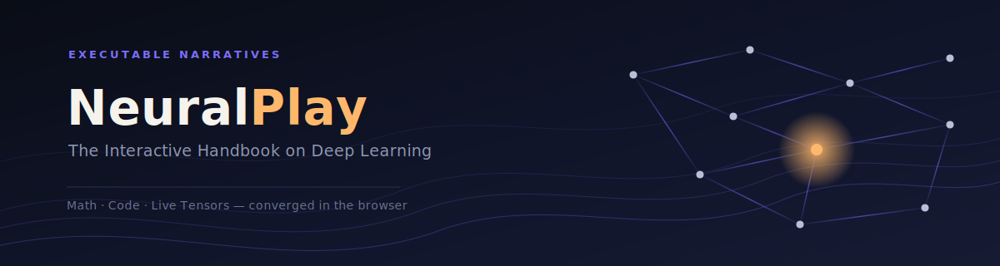

# Preface

*An open-source, high-performance pedagogical platform for demystifying deep learning through Executable Narratives.*

---

## A Book Told as a Story

Most books teach architectures like dictionary entries — defined, not lived in. This one is a history. Every chapter follows the same shape: 
**a wall an existing method hit, the idea that got past it, and the architecture that resulted.**

## Who This Book Is For

A history can be read at any depth, and this one is written to be. The same chapter on convolutional networks works for a high school student who has never seen a derivative, a college graduate who has, and a PhD researcher who wants to know exactly where the method still breaks. Nobody is handed a watered-down version of the story — everybody gets the same wall, the same idea, and the same architecture. What changes is how far down into the mechanism you choose to go.

- **If you're in high school or just starting out**, read for the story and the picture. Every chapter opens with plain language and an interactive visual before a single equation appears, and you can stop there and still walk away understanding *why* the architecture exists and what problem it solved.
- **If you're a college graduate or a working engineer**, the mechanism and the from-scratch implementation are written for you. You'll derive the key equations, read the plain NumPy code line by line, and see exactly how the PyTorch or TensorFlow version compresses those same lines into a handful of calls.
- **If you hold a PhD or work in research**, each chapter closes with the architecture's limitations, the debates its introduction settled or reopened, and pointers into the original papers — the detail that turns a history lesson into a literature review.

Nothing in the book gates a later section behind an earlier one you didn't want to read. The interactive modules let you expand or collapse the math and the code independently of the narrative, so you can read the story straight through on a first pass and come back for the derivations later, or skip straight to the implementation if that's what you're there for.

## What Each Chapter Actually Does

For every algorithm covered, this book does four things, in order — each written to be entered at whichever depth suits the reader:

- **Tells the origin story.** What problem existed before this method, who was trying to solve it, and why the previous best approach fell short. History, not hagiography — including the false starts and the competing ideas that lost. This part alone requires no math background.
- **Explains the mechanism.** Not just the final equations, but the reasoning that led there: why the architecture is shaped the way it is, and what would break if you removed each piece. Derivations are walked through step by step rather than dropped in fully formed.
- **Analyses the architecture.** Diagrams and side-by-side comparisons against the methods that came before and after it — what it's better at, what it's worse at, and where it eventually hit its own wall, along with the open questions researchers still argue about.
- **Builds it twice.** Every architecture is implemented from scratch, in plain Python and NumPy, so nothing is hidden behind a library call — and then again in PyTorch and TensorFlow, so you can see exactly what the framework is doing for you and why that matters in practice.

## Learning by Running the History

This is also where NeuralPlay, the platform, does its work. Every architecture in this book is not just described — it runs, live, on the page, using the platform's interactive modules:

- **Live Tensors** — high-dimensional weight topologies and activation manifolds are rendered in navigable 3-D, using WebGPU, so you can rotate a loss surface instead of just imagining one.
- **In-Browser Execution** — the from-scratch and framework implementations both train and evaluate directly on the page, powered by Pyodide and ONNX Runtime Web, so you can alter a line of code from the chapter you're reading and immediately watch the model respond.
- **Reactive Math** — every typeset equation is live: drag a variable in the text and the corresponding parameter updates in the running model, and vice versa.
- **Side-by-Side Implementations** — the from-scratch and PyTorch/TensorFlow versions of each architecture sit next to each other, so you can trace a single operation, like a matrix multiply or a gradient update, across both.
- **Constraint-Based Exercises** — once an architecture has been introduced, you're handed a target rather than a script: tune the hyperparameters yourself until a stated convergence criterion is met.
- **Depth Toggles** — every section can be expanded or collapsed independently: read the story with the math and code hidden, reveal the derivation when you're ready for it, or jump straight to the implementation and work backward.


## Under the Hood

| Layer | Technology |
|---|---|
| Framework | Next.js & React |
| Computation | Pyodide & ONNX Runtime Web |
| Visualization | Three.js / React-Three-Fiber |
| State | Zustand |
| Typesetting | KaTeX |

## Run It Locally

```bash
git clone https://github.com/yourusername/NeuralPlay.git
cd NeuralPlay
npm install
npm run dev
```

Modules run at `localhost:3000`, one per chapter.

## How It's Organized

Chronological, by the problem each era faced:

- **Foundations** — perceptrons, backprop.
- **Seeing** — CNNs.
- **Remembering** — RNNs, LSTMs.
- **Attending** — attention, Transformers.
- **Generating** — autoencoders, GANs, diffusion.

## Contributing

Open source. Contribute an origin story, a diagram, or an implementation — see the contributing guide.

## License

MIT. Handbook terms in its colophon.

---

### References

github.com/yourusername/NeuralPlay · nextjs.org · pyodide.org · onnxruntime.ai · threejs.org · docs.pmnd.rs/react-three-fiber · zustand-demo.pmnd.rs · katex.org · pytorch.org · tensorflow.org

